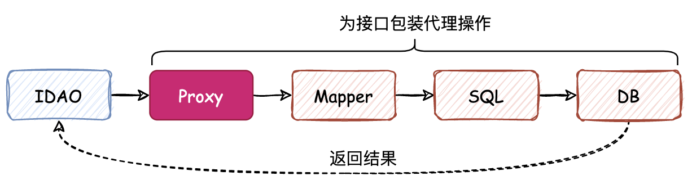

## 🐦 mybatis-q

一个模仿 MyBatis 自定义实现的迷你 ORM 框架。🫣

### 💡 核心：

- 📑 读取 XML 文件的配置，解析内容后获取信息；
- 📖 通过动态代理，生成对应 Mapper 接口的代理对象 MapperProxy，代理对象中根据配置生成了一系列具体实现；
- 📬 使用代理对象完成所有数据库相关操作。

### 🕊️ step

- 🪶 [创建简单的映射器代理工厂](https://github.com/EmeryWan/mybatis-q/tree/step/mybatis-q-step-01)
- 🪶 [实现映射器的注册和使用](https://github.com/EmeryWan/mybatis-q/tree/step/mybatis-q-step-02)
- 🪶 [Mapper XML 的解析和注册使用](https://github.com/EmeryWan/mybatis-q/tree/step/mybatis-q-step-03)
- 🪶 [数据源的解析、创建和使用，定义事务框架](https://github.com/EmeryWan/mybatis-q/tree/step/mybatis-q-step-04)
- 🪶 [数据源池化技术实现](https://github.com/EmeryWan/mybatis-q/tree/step/mybatis-q-step-05)
- 🪶 [SQL执行器的定义和实现](https://github.com/EmeryWan/mybatis-q/tree/step/mybatis-q-step-06)
- 🪶 [添加反射相关工具](https://github.com/EmeryWan/mybatis-q/tree/step/mybatis-q-step-07)
- 🪶 [细化 XML 语句构建器，完善静态 SQL 解析](https://github.com/EmeryWan/mybatis-q/tree/step/mybatis-q-step-08)
- 🪶 [参数类型策略化处理](https://github.com/EmeryWan/mybatis-q/tree/step/mybatis-q-step-09)
- 🪶 [解耦流程，封装结果处理器](https://github.com/EmeryWan/mybatis-q/tree/step/mybatis-q-step-10)
- 🪶 [完善 ORM 框架流程](https://github.com/EmeryWan/mybatis-q/tree/step/mybatis-q-step-11)
