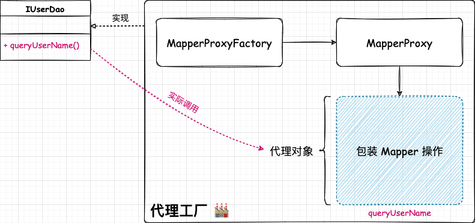

## 创建简单的映射器代理工厂


### ❓ 问题

在使用 ORM 框架 MyBatis 时，通常只需要：编写 Mapper 接口类，在 XML 文件中编写 SQL 语句，即使不对 Mapper 接口进行实现，就可以进行对应的操作？


### 🎨 设计


通过使用动态代理的方式，生成对应 interface Mapper 的代理对象，实现对应的逻辑。

- `MapperProxy`

映射器 Mapper 的代理类，实现 `InvocationHandler#invoke`，在 `invoke()` 中实现实现具体的代理 SQL 操作（这里暂时是简单示例）。

- `MapperProxyFactory`

映射器代理类的创建工厂（简单工厂模式）。一个项目中有很多的 Mapper 接口需要代理，使用工厂创建映射器代理类，屏蔽创建细节。



### 💡 结果

ORM 框架的核心：通过动态代理，生成代理对象（代理接口），创建对应 interface Mapper 的代理对象。

完成怎么给一个接口类生成对应的映射器代理，并在代理类中完成用户对接口方法的调用处理。

```
mybatis-q-step-01
└── src
    ├── main
    │   └── java
    │       └── cn.letout.mybatis.binding
    │           ├── MapperProxy.java  # Mapper 的代理实现类，implement InvocationHandler，所以实际的数据库 SQL 操作，都由该代理类中实现
    │           └── MapperProxyFactory.java  # 对外提供实例化 MapperProxy 的方法，为每个 IDao 接口生成对于的代理类
    └── test
```
