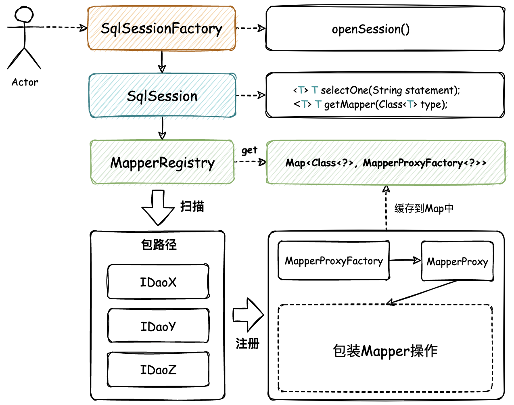

## 实现映射器的注册和使用


### ❓ 问题

怎么告知 `MapperProxyFactory` 对哪个接口进行代理？（之前的实现通过手动传入）
==> 对一个包路径下的 Mapper 进行扫描和注册？


如何对 `SqlSession` 进行规范化处理？（之前是假设处理：实际调用接口、返回的结果内容）
（`SqlSession` 可以把映射器代理 `MapperProxy` 和方法调用进行包装，建立一个生命周期模型结构）


### 🎨 设计


利用一个注册器类 `MapperRegistry` 扫描包路径下的接口，将每个接口映射的代理类存入缓存中（`HashMap`）。

`SqlSession` 中定义数据库处理接口，和获取 Mapper 对象的操作，并交给映射器代理类 `MapperProxy` 使用。



- `MapperRegistry`

（1）扫描包路径
（2）为包路径下的 Mapper 接口创建映射器代理工厂 `MapperProxyFactory`
（3）将代理工厂放入缓存 `knownMappers(HashMap)` 中，供创建 Mapper 接口的代理对象使用
（4）`getMapper()` 调用代理工厂创建对应 Mapper 的代理对象

- `SqlSession`

`MapperRegistry` 只负责将 Mapper 交给指定的代理工厂，真正执行 SQL 操作要由 `SqlSession` 来完成。

在 Mybatis 中，`SqlSession` 通常包含 Mapper 的增删改查接口、事务管理操作

### 💡 结果

完成对包路径下 Mapper 接口的扫描和代理工厂的创建。

完善对 SqlSession 的操作，并创建了默认实现 `DefaultSession` 和对应的代理工厂。


```
mybatis-q-step-02
└── src
    ├── main
    │   └── java
    │       └── cn.letout.mybatis
    │           ├── binding
    │           │   ├── MapperProxy.java
    │           │   ├── MapperProxyFactory.java
    │           │   └── MapperRegistry.java  # 扫描包路径；生成包路径下的接口对应的 MapperProxyFactory，并缓存到 Map 中
    │           └── session
    │               ├── defaults
    │               │   ├── DefaultSqlSession.java  # SqlSession 默认实现。作用：（1）获取 Mapper 的代理对象；（2）直接或间接地利用代理对象，执行一些通用数据库操作
    │               │   └── DefaultSqlSessionFactory.java
    │               ├── SqlSession.java  # 定义执行 SQL 的标准；获取 Mapper；管理事务等操作（接口）
    │               └── SqlSessionFactory.java
    └── test
```