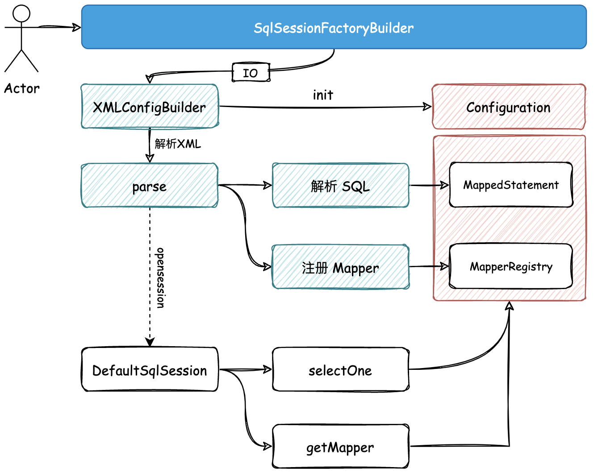

## Mapper XML 的解析和注册使用


### ❓ 问题

- 添加 Mapper.xml 文件，namespace、sql 及相关参数都在 XML 中配置，而不是硬编码
- 通过解析 XML
  - 完成 Mapper 的注册（注册代理对象工厂，用于创建 Mapper 的动态代理对象）
  - SQL 相关信息的管理


### 🎨 设计



- 定义 `SqlSessionFactoryBuilder` 工厂建造者模式类，通过入口 IO 的方式对 XML 文件进行解析。

- 文件解析以后会存放到 `Configuration` 配置类中。配置类 `Configuration` 会被串联到整个 Mybatis 流程中，所有内容存放和读取都通过该类。

### 💡 结果

`SqlSessionFactoryBuilder` 的引入包装了整个执行过程，包括：XML 文件的解析、Configuration 配置类的处理， 让 `DefaultSqlSession` 可以更加灵活的拿到对应的信息，获取 Mapper 和 SQL 语句。


```
mybatis-q-step-03
└── src
    ├── main
    │   └── java
    │       └── cn.letout.mybatis
    │           ├── binding
    │           │   ├── MapperMethod.java  # 利用内部类，封装 SQL 的 name 和 type
    │           │   ├── MapperProxy.java
    │           │   ├── MapperProxyFactory.java
    │           │   └── MapperRegistry.java  # # 扫描包路径；生成包路径下的接口对应的 MapperProxyFactory，并注册到 Map 中
    │           ├── builder
    │           │   ├── xml
    │           │   │   └── XMLConfigBuilder.java  # 用于解析 XML，获取信息后，初始化 Configuration，并将信息存入
    │           │   └── BaseBuilder.java  # abstract class
    │           ├── io
    │           │   └── Resources.java  # 通过文件名，获取输入流
    │           ├── mapping
    │           │   ├── MappedStatement.java  # 被映射的语句类，用于记录 SQL 信息：SQL 类型，语句、入参、出参
    │           │   └── SqlCommandType.java  # enum 定义所有 SQL 的类型
    │           └── session
    │               ├── defaults
    │               │   ├── DefaultSqlSession.java
    │               │   └── DefaultSqlSessionFactory.java
    │               ├── Configuration.java  # Configuration 串联整个 Mybatis 的流程，所有的内容存放和读取都通过该类
    │               ├── SqlSession.java  # interface
    │               ├── SqlSessionFactory.java  # interface
    │               └── SqlSessionFactoryBuilder.java  # 创建 SqlSessionFactory 的构建器，是整个 MyBatis 的入口。通过解析指定 XML 的 IO，引导整个流程的启动
    └── test
```

