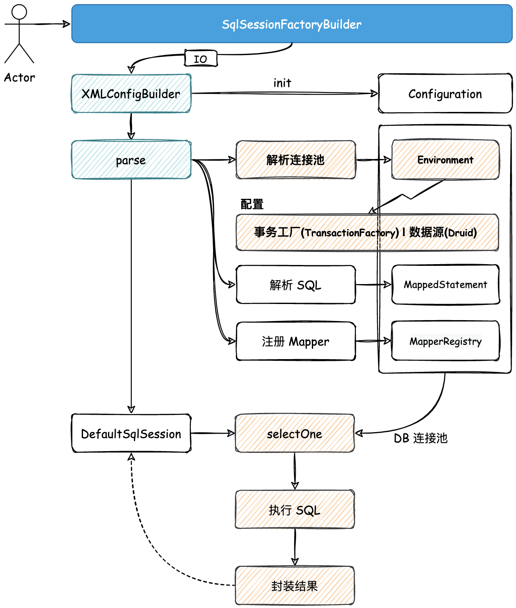
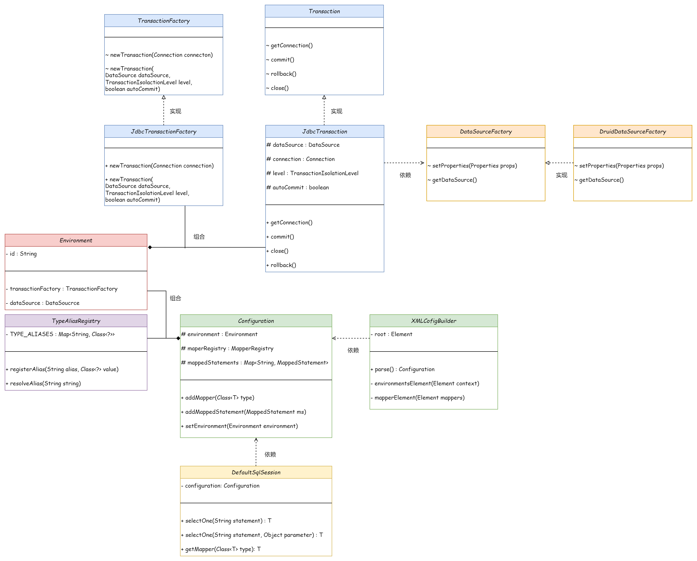

## 数据源的解析、创建和使用，定义事务框架


- 解析配置（数据源配置，SQL相关配置）
- 建立事务框架
- 引入 DRUID 创建连接
- 初步完成 SQL 的执行 和 结果简单包装



### 🎨 设计

- 创建 TypeAliasRegistry 类型别名注册器，放入 Configuration 中，初始化时，将基本类型和需要使用到的类注册进去
- 解析 XML config 中的 DataSource，将所需要的配置放入 DataSourceFactory
- 封装事务信息（获取连接、提交、回滚、关闭等），并利用事务工厂创建事务
- 将 SQL 相关的信息封装为 BoundSql（参数类型、参数列表、SQL、返回值类型等）
- 使用 Environment 聚合 数据源 dataSource 和 事务工厂 transactionFactory，并放入 Configuration 中


---





```
mybatis-q-step-04
└── src
    ├── main
    │   └── java
    │       └── cn.letout.mybatis
    │           ├── binding
    │           │   ├── MapperMethod.java
    │           │   ├── MapperProxy.java
    │           │   ├── MapperProxyFactory.java
    │           │   └── MapperRegistry.java
    │           ├── builder
    │           │   ├── xml
    │           │   │   └── XMLConfigBuilder.java  # 在之前的实现上，添加解析数据源配置
    │           │   └── BaseBuilder.java
    │           ├── datasource
    │           │   ├── druid
    │           │   │   └── DruidDataSourceFactory.java  # 利用 XML 数据源配置 和 Druid 构建数据源 dataSource
    │           │   └── DataSourceFactory.java  # interface 数据源工厂
    │           ├── io
    │           │   └── Resources.java
    │           ├── mapping
    │           │   ├── BoundSql.java  # 解析格式化好的 SQL 语句的封装
    │           │   ├── Environment.java  # 根据 XML 中解析的数据源信息生成的环境，包含数据源 dataSource、事务工厂 transactionFactory，使用数据源 dataSource 来获取连接
    │           │   ├── MappedStatement.java  # 记录解析出来的 SQL 信息：SQL 类型，语句、入参、出参
    │           │   ├── ParameterMapping.java  # 参数映射 jdbc type <---> java type 记录了一条 SQL 的参数信息，如参数名，参数 jdbcType，参数 javaType
    │           │   └── SqlCommandType.java
    │           ├── session
    │           │   ├── defaults
    │           │   │   ├── DefaultSqlSession.java
    │           │   │   └── DefaultSqlSessionFactory.java
    │           │   ├── Configuration.java
    │           │   ├── SqlSession.java
    │           │   ├── SqlSessionFactory.java
    │           │   ├── SqlSessionFactoryBuilder.java
    │           │   └── TransactionIsolationLevel.java  # enum 事务隔离级别
    │           ├── transaction
    │           │   ├── jdbc
    │           │   │   ├── JdbcTransaction.java  # JDBC 事务的实现
    │           │   │   └── JdbcTransactionFactory.java
    │           │   ├── Transaction.java  # interface 定义标注的事务的接口，具体实现交给不同的事务方式。获取连接、提交、回滚、关闭。
    │           │   └── TransactionFactory.java  # interface 事务工厂。可以通过参数，打开不同配置的事务（如隔离级别、自动提交等）
    │           └── type
    │               ├── JdbcType.java  # enum jdbc 的数据类型
    │               └── TypeAliasRegistry.java  # 类型别名注册器，注册各种类型->Class，获取类型对应的 Class 类别（用于解析XML中配置的类别，对应到一个Java类型）
    └── test
```


