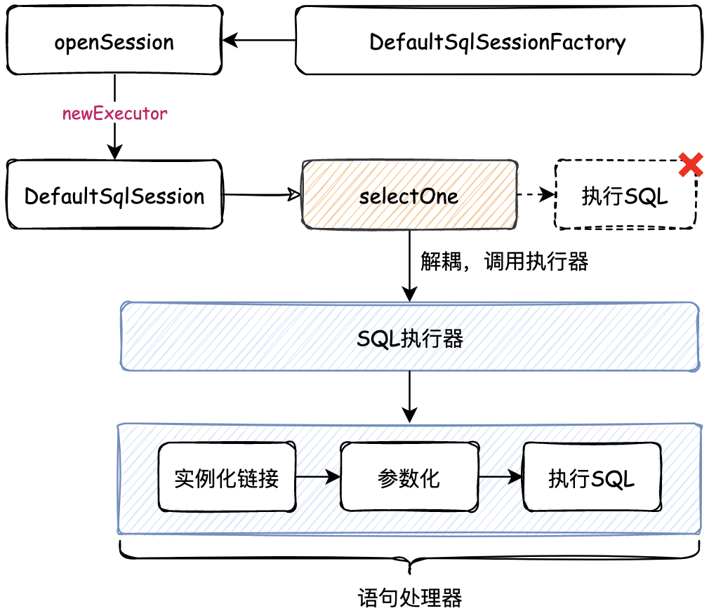

## SQL 执行器的定义与实现

添加 SQL Executor，解耦 SQL 的执行过程

之前的 SQL 执行都耦合到了 SqlSession 中，一旦需要进行扩展，就需要修改 SqlSession，为了降低耦合，将执行 SQL 的逻辑拆分到 SQL Executor。




```
mybatis-q-step-06
└── src
    ├── main
    │   └── java
    │       └── cn.letout.mybatis
    │           ├── binding
    │           │   ├── MapperMethod.java
    │           │   ├── MapperProxy.java
    │           │   ├── MapperProxyFactory.java
    │           │   └── MapperRegistry.java
    │           ├── builder
    │           ├── datasource
    │           ├── executor
    │           │   ├── resultset
    │           │   │   ├── DefaultResultSetHandler.java
    │           │   │   └── ResultSetHandler.java
    │           │   ├── statement
    │           │   │   ├── BaseStatementHandler.java
    │           │   │   ├── PreparedStatementHandler.java
    │           │   │   ├── SimpleStatementHandler.java
    │           │   │   └── StatementHandler.java
    │           │   ├── BaseExecutor.java  # abstract class 完成一些执行器的通用方法
    │           │   ├── Executor.java  # interface 执行器
    │           │   └── SimpleExecutor.java
    │           ├── io
    │           ├── mapping
    │           ├── session
    │           │   ├── defaults
    │           │   │   ├── DefaultSqlSession.java
    │           │   │   └── DefaultSqlSessionFactory.java
    │           │   ├── Configuration.java
    │           │   ├── ResultHandler.java
    │           │   ├── SqlSession.java
    │           │   ├── SqlSessionFactory.java
    │           │   ├── SqlSessionFactoryBuilder.java
    │           │   └── TransactionIsolationLevel.java
    │           ├── transaction
    │           └── type
    └── test
```
