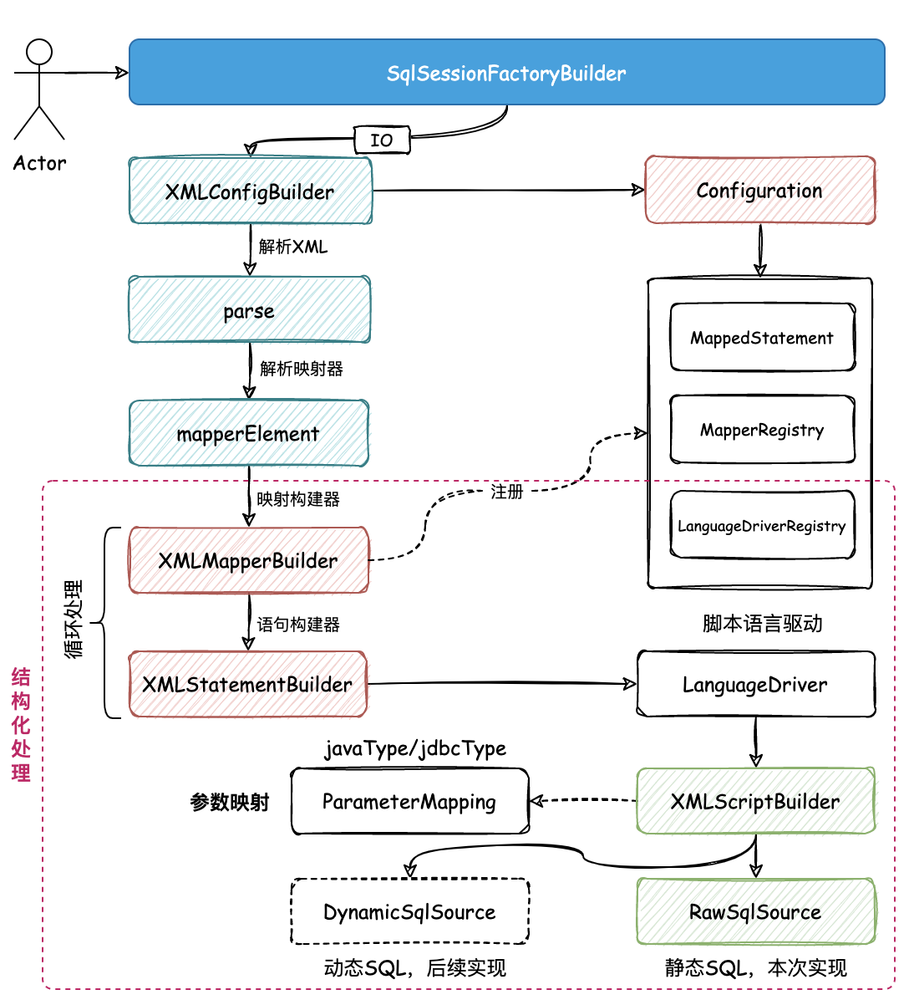

## 细化 XML 语句构建器，完善静态 SQL 解析

### 🔧 细化 XML 语句构建器


### 🔍 完善静态 SQL 解析

```xml
<!-- 静态 SQL -->
<select id="queryUserInfoById" parameterType="java.lang.Long" resultType="cn.letout.mybatis.po.User">
    SELECT id, userId, userName, userHead
    FROM user
    where id = #{id}
</select>
```



```
mybatis-q-step-08
└── src
    ├── main
    │   └── java
    │       └── cn.letout.mybatis
    │           ├── binding
    │           ├── builder
    │           │   ├── xml
    │           │   │   ├── XMLConfigBuilder.java
    │           │   │   ├── XMLMapperBuilder.java
    │           │   │   └── XMLStatementBuilder.java
    │           │   ├── BaseBuilder.java
    │           │   ├── ParameterExpression.java
    │           │   ├── SqlSourceBuilder.java
    │           │   └── StaticSqlSource.java
    │           ├── datasource
    │           ├── executor
    │           │   ├── resultset
    │           │   │   ├── DefaultResultSetHandler.java
    │           │   │   └── ResultSetHandler.java
    │           │   ├── statement
    │           │   │   ├── BaseStatementHandler.java
    │           │   │   ├── PreparedStatementHandler.java
    │           │   │   ├── SimpleStatementHandler.java
    │           │   │   └── StatementHandler.java
    │           │   ├── BaseExecutor.java
    │           │   ├── Executor.java
    │           │   └── SimpleExecutor.java
    │           ├── io
    │           ├── mapping
    │           │   ├── BoundSql.java
    │           │   ├── Environment.java
    │           │   ├── MappedStatement.java
    │           │   ├── ParameterMapping.java
    │           │   ├── SqlCommandType.java
    │           │   └── SqlSource.java
    │           ├── parsing
    │           │   ├── GenericTokenParser.java
    │           │   └── TokenHandler.java
    │           ├── reflection
    │           ├── scripting
    │           │   ├── defaults
    │           │   │   ├── DefaultParameterHandler.java
    │           │   │   └── RawSqlSource.java
    │           │   ├── xmltags
    │           │   │   ├── DynamicContext.java
    │           │   │   ├── MixedSqlNode.java
    │           │   │   ├── SqlNode.java
    │           │   │   ├── StaticTextSqlNode.java
    │           │   │   ├── XMLLanguageDriver.java
    │           │   │   └── XMLScriptBuilder.java
    │           │   ├── LanguageDriver.java
    │           │   └── LanguageDriverRegistry.java
    │           ├── session
    │           │   ├── defaults
    │           │   │   ├── DefaultSqlSession.java
    │           │   │   └── DefaultSqlSessionFactory.java
    │           │   ├── Configuration.java
    │           │   ├── ResultHandler.java
    │           │   ├── SqlSession.java
    │           │   ├── SqlSessionFactory.java
    │           │   ├── SqlSessionFactoryBuilder.java
    │           │   └── TransactionIsolationLevel.java
    │           ├── transaction
    │           └── type
    │               ├── JdbcType.java
    │               ├── TypeAliasRegistry.java
    │               ├── TypeHandler.java
    │               └── TypeHandlerRegistry.java
    └── test
```
