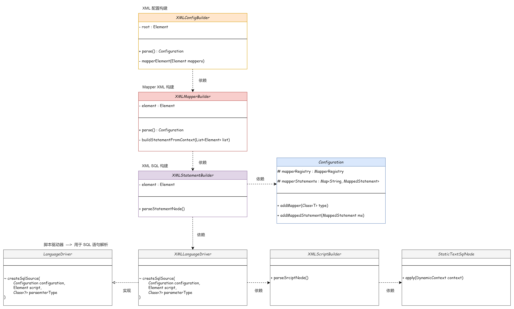

## 细化 XML 语句构建器，完善静态 SQL 解析


### 🔧 细化 XML 语句构建器


之前的实现中，XML 的解析都全部耦合在 `XMLConfigBuilder # mapperElement()` 中，在循环中写了所有的逻辑。


`XMLConfigBuilder` 解析 XML 中的配置，数据库环境，定位 mapper 的 XML 文件，并调用处理 mapper 的方法。

解析处理在 MyBatis 中使用了 Ognl 的方式（DynamicContext），解析 XML 的过程了解即可。简单实现的话可以用 String 截取或正则匹配等。


为了各个模块的流程上符合单一职责，细化的功能由不同的构建器 Builder 实现，职责明确

将功能拆分为：


- `XMLMapperBuilder` 映射构建器

  解析 `parse()` 各个 XXXMapper.xml 文件，构建接口对应的 Mapper。

  
  在 `buildStatementFromContext()` 调用 语句构建器 `XMLStatementBuilder` 相应方法，专门用于解析并构建 SQL 语句相关信息。


- `XMLStatementBuilder` 语句构建器

  解析 XML 配置的 SQL 语句相关内容，生成对应的 `MappedStatement` 对象，并放到 `Configuration -> Map` 中。

  具体处理是交给 `XMLLanguageDriver` XML 语言驱动器来具体操作 静态 SQL `RawSqlSource` 和 动态 SQL `DynamicSqlSource` 的解析


- `XMLScriptBuilder` 脚本构建器

  具体操作 静态 SQL `RawSqlSource` 和 动态 SQL `DynamicSqlSource` 的解析
 
  用于最终实例化原始 SQL 源码对象 `RawSqlSource`

  在 `RawSqlSource` 中实例化 `SqlSourceBuilder`
 
  



### 🔍 完善静态 SQL 解析

- `SqlSourceBuilder` SQL 源码构建器

  用来具体处理 SQL 中的参数

  - 使用 ParameterMappingTokenHandler 获取 #{} 中的参数，存入 BoundSql->parameterMappings
  - 使用 GenericTokenParser 将 #{} 解析成 ? （PreparedStatement）
  - 使用 ParameterExpression 解析 property javaType jdbcType


```xml
<!-- 静态 SQL -->
<select id="queryUserInfoById" parameterType="java.lang.Long" resultType="cn.letout.mybatis.po.User">
    SELECT id, userId, userName, userHead
    FROM user
    where id = #{id}
</select>
```


```
mybatis-q-step-08
└── src
    ├── main
    │   └── java
    │       └── cn.letout.mybatis
    │           ├── binding
    │           ├── builder
    │           │   ├── xml
    │           │   │   ├── XMLConfigBuilder.java  # 解析 XML 配置文件，一些特殊的处理具体的交由各个对应的 Bulider 处理（优点类似于责任链，不同的XML配置交由对应的“处理器”处理）
    │           │   │   ├── XMLMapperBuilder.java  # 解析各个 XXXMapper.xml 文件，提供方法给 XMLConfigBuilder 调用
    │           │   │   └── XMLStatementBuilder.java  # 解析 XML 中的 select / insert / update / delete 语句
    │           │   ├── BaseBuilder.java 
    │           │   ├── ParameterExpression.java  # 用于解析参数表达式： #{property,javaType=int,jdbcType=NUMERIC}
    │           │   ├── SqlSourceBuilder.java  # SQL 源码构建器，用于具体处理 SQL 中的参数
    │           │   └── StaticSqlSource.java  # 静态 SQL（普通的增删改查 SQL）
    │           ├── datasource
    │           ├── executor
    │           │   ├── resultset
    │           │   │   ├── DefaultResultSetHandler.java  # 结果处理器默认实现
    │           │   │   └── ResultSetHandler.java  # 结果处理器
    │           │   ├── statement
    │           │   │   ├── BaseStatementHandler.java  # abstract class 模板模式
    │           │   │   ├── PreparedStatementHandler.java  # 最常用的 StatementHandler 的具体实现之一，PreparedStatement 设置 SQL，传递参数的设置
    │           │   │   ├── SimpleStatementHandler.java  # StatementHandler 的具体实现之一，处理没有参数的简单语句处理器
    │           │   │   └── StatementHandler.java  # 语句处理器标准：准备语句、参数化传递、执行 SQL、封装结果
    │           │   ├── BaseExecutor.java  # abstract class 完成一些执行器的通用方法（模板模式）
    │           │   ├── Executor.java  # interface 执行器标准的流程定义：执行方法、事务获取、提交、回滚、关闭
    │           │   └── SimpleExecutor.java  # 简单执行器的实现
    │           ├── io
    │           ├── mapping
    │           │   ├── BoundSql.java
    │           │   ├── Environment.java
    │           │   ├── MappedStatement.java
    │           │   ├── ParameterMapping.java  # 参数映射，记录了一条 SQL 的所有信息，参数名，参数 jdbcType，参数 javaType
    │           │   ├── SqlCommandType.java
    │           │   └── SqlSource.java  # interface，定义获取解析后的 SQL 方法
    │           ├── parsing
    │           │   ├── GenericTokenParser.java
    │           │   └── TokenHandler.java
    │           ├── reflection
    │           ├── scripting
    │           │   ├── defaults
    │           │   │   ├── DefaultParameterHandler.java
    │           │   │   └── RawSqlSource.java  # 静态 SQL
    │           │   ├── xmltags
    │           │   │   ├── DynamicContext.java  # Ognl
    │           │   │   ├── MixedSqlNode.java
    │           │   │   ├── SqlNode.java
    │           │   │   ├── StaticTextSqlNode.java
    │           │   │   ├── XMLLanguageDriver.java  # 简单封装对 XMLScriptBuilder 的调用处理，XMLStatementBuilder 获取 XML 的 SQL 语句后，由 LanguageDriver 来具体解析：静态 SQL 和动态 SQL
    │           │   │   └── XMLScriptBuilder.java
    │           │   ├── LanguageDriver.java  # interface 提供创建 SQL 信息的方法    
    │           │   └── LanguageDriverRegistry.java
    │           ├── session
    │           │   ├── defaults
    │           │   │   ├── DefaultSqlSession.java
    │           │   │   └── DefaultSqlSessionFactory.java
    │           │   ├── Configuration.java
    │           │   ├── ResultHandler.java
    │           │   ├── SqlSession.java
    │           │   ├── SqlSessionFactory.java
    │           │   ├── SqlSessionFactoryBuilder.java
    │           │   └── TransactionIsolationLevel.java
    │           ├── transaction
    │           └── type
    │               ├── JdbcType.java
    │               ├── TypeAliasRegistry.java
    │               ├── TypeHandler.java
    │               └── TypeHandlerRegistry.java
    └── test
```
