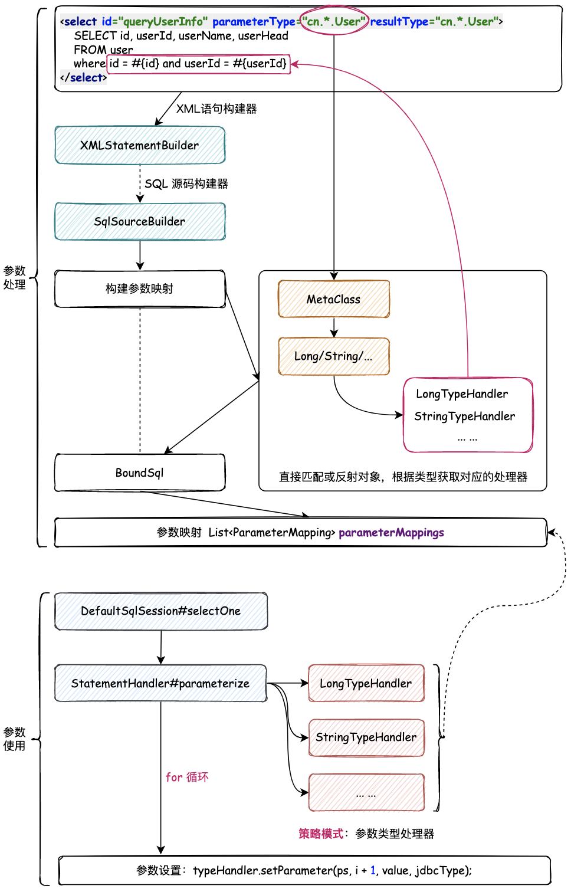

## 使用策略模式，调用参数处理器




在之前的实现中，`PreparedStatementHandler # parameterize()` 中通过硬编码的方式设置参数。

这里的参数设置，也就是再执行 SQL 时，对 `PreparedStatementHandler` 中的 `?` 进行参数替换，这里的实现，就是要将之前的硬编码的方式，处理为自动化类型设置。


### 策略模式

定义一组算法，将每个算法都用一个类封装起来，在运行时，可以灵活地替换这些算法（替换执行地策略）。

使用接口 `TypeHandler` / 抽象类 `BaseTypeHander` 定义具体策略的通用方法，每个封装算法的类都实现这个接口 / 继承这个抽象类 `LongTypeHandler` `StringTypeHandler`。


### 设计

#### 构建参数

在之前的设计中，只有一个参数，所以构建 ParameterMapping 参数映射时，可以直接获取参数的类型。

现在引入对象作为入参，需要判断参数是否有对应的类型处理器：

- 有对应参数的类型处理器，说明时普通类型（如 Long）
- 没有，说明是对象类型（如 User），需要获取对象的元对象 MetaClass，再从中获取指定的属性值，才能构建参数对象 ParameterMapping

#### 使用参数

遍历 ParameterMapping 集合，设置参数值

- 参数有对应的类型处理器 -> 基本类型，直接调用其类型处理器设置属性值
- 无对应的参数处理器 -> 将对象转换为元对象获取其对应的属性值，再进行属性赋值

通过调用实例化的类型处理器，完成具体类型的属性赋值

```
mybatis-q-step-09
└── src
    ├── main
    │   └── java
    │       └── cn.letout.mybatis
    │           ├── binding
    │           │   ├── MapperMethod.java
    │           │   ├── MapperProxy.java
    │           │   ├── MapperProxyFactory.java
    │           │   └── MapperRegistry.java
    │           ├── builder
    │           │   ├── xml
    │           │   │   ├── XMLConfigBuilder.java
    │           │   │   ├── XMLMapperBuilder.java
    │           │   │   └── XMLStatementBuilder.java
    │           │   ├── BaseBuilder.java
    │           │   ├── ParameterExpression.java
    │           │   ├── SqlSourceBuilder.java
    │           │   └── StaticSqlSource.java
    │           ├── datasource
    │           ├── executor
    │           │   ├── resultset
    │           │   │   └── ParameterHandler.java
    │           │   ├── resultset
    │           │   │   ├── DefaultResultSetHandler.java
    │           │   │   └── ResultSetHandler.java
    │           │   ├── statement
    │           │   │   ├── BaseStatementHandler.java
    │           │   │   ├── PreparedStatementHandler.java
    │           │   │   ├── SimpleStatementHandler.java
    │           │   │   └── StatementHandler.java
    │           │   ├── BaseExecutor.java
    │           │   ├── Executor.java
    │           │   └── SimpleExecutor.java
    │           ├── io
    │           ├── mapping
    │           │   ├── BoundSql.java
    │           │   ├── Environment.java
    │           │   ├── MappedStatement.java
    │           │   ├── ParameterMapping.java
    │           │   ├── SqlCommandType.java
    │           │   └── SqlSource.java
    │           ├── parsing
    │           ├── reflection
    │           ├── scripting
    │           │   ├── defaults
    │           │   │   ├── DefaultParameterHandler.java
    │           │   │   └── RawSqlSource.java
    │           │   ├── xmltags
    │           │   │   ├── DynamicContext.java
    │           │   │   ├── MixedSqlNode.java
    │           │   │   ├── SqlNode.java
    │           │   │   ├── StaticTextSqlNode.java
    │           │   │   ├── XMLLanguageDriver.java
    │           │   │   └── XMLScriptBuilder.java
    │           │   ├── LanguageDriver.java
    │           │   └── LanguageDriverRegistry.java
    │           ├── session
    │           │   ├── defaults
    │           │   │   ├── DefaultSqlSession.java
    │           │   │   └── DefaultSqlSessionFactory.java
    │           │   ├── Configuration.java
    │           │   ├── ResultHandler.java
    │           │   ├── SqlSession.java
    │           │   ├── SqlSessionFactory.java
    │           │   ├── SqlSessionFactoryBuilder.java
    │           │   └── TransactionIsolationLevel.java
    │           ├── transaction
    │           └── type
    │               ├── BaseTypeHandler.java  # abstract class 模板方法模式，定义抽象方法，让子类实现
    │               ├── JdbcType.java
    │               ├── LongTypeHandler.java  # Long 类型赋值处理（策略模式算法之一）
    │               ├── StringTypeHandler.java  # String（策略模式算法之一）
    │               ├── TypeAliasRegistry.java
    │               ├── TypeHandler.java  # 类型处理器标准接口
    │               └── TypeHandlerRegistry.java
    └── test
```
