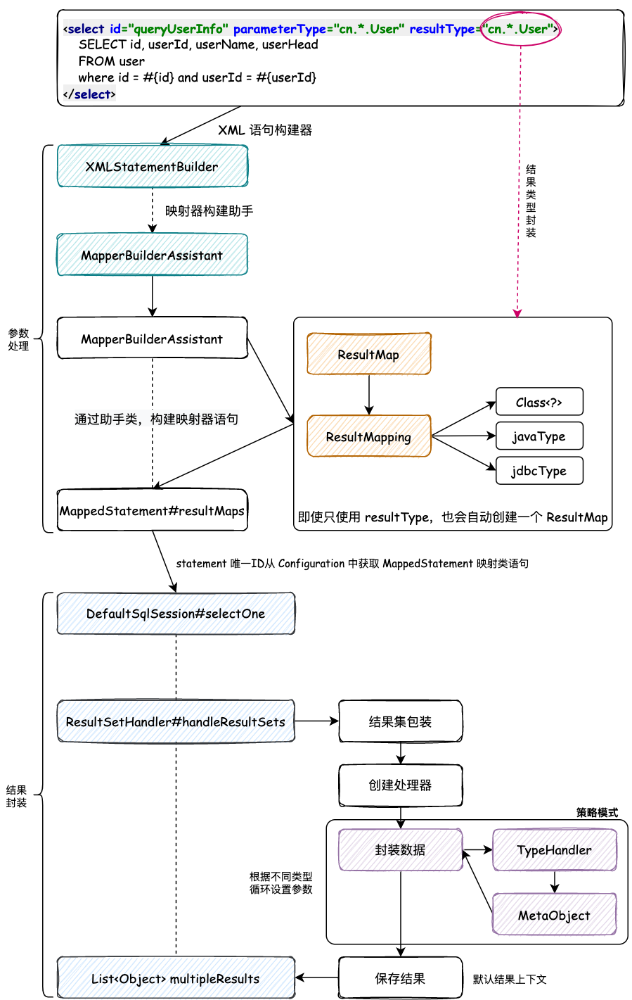
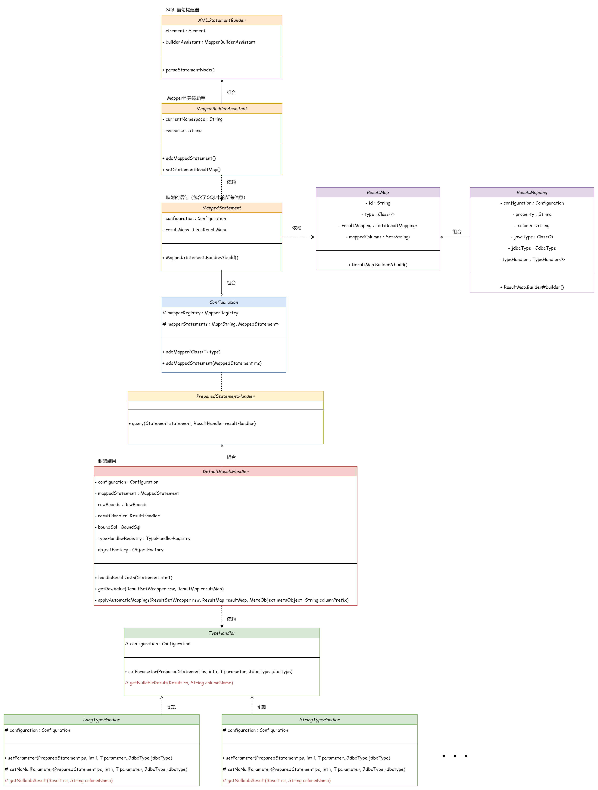

## 解耦流程，封装结果集处理器

核心：拿到 Mapper XML 中所配置的返回类型，解析后把数据库查询到的结构，通过反射设置到实例化的对象上。

从数据库中查询到的结果，可能是基本类型（Long、Double、Integer），也可能是封装后的对象类型；可能是一条记录，也可能是多条记录。
为了处理多种情况下的不同问题，需要对过程进行抽象化实现解耦，满足不同的情况。

### 设计




#### 定义出参对象

- `ResultMap`

结果映射类。使用 id、type（结果对应的Java类型`Class<?>`）、resultMappings（映射的结果集`List<ResultMapping>`）、数据库中对应的字段（`Set<String> mappedColumns`） 用于包装返回结果。

- `ResultMapping`

与 `ParameterMapping` 类似，是查询结果的字段与Java类型的映射关系的封装，包含结果名、结果类型、java类型等。

- `MapperBuilderAssistant`

映射器构建助手类，用于构建 `MappedStatement`。在 `MappedStatement` 中，封装了入参映射、出参映射、将配置信息写入 `Configuration` 中，

将 Mapper XML 中配置的返回值类型 `resultType` 封装成 `ResultMap` 对象，按照职责细分解耦，使得返回值类型能够被统一为 `ResultMap` 对象（这部分在初始化解析 XML 文件时实现）。


#### 封装查询结果

创建结果集处理器 `ResultHandler`，封装数据，保存结果，具体使用 `ResultSetHandler#handleResultSet`。

核心在于使用反射创建 `ResultType` 对应的 Java 对象，通过对应的属性类型（`ResultMapping`）获取对应的属性值，使用 `TypeHanlder` 填充。
这里类似于参数填充的部分，同样利用策略模式使用对应类型的 `TypeHandler` 填充属性。


---





```
mybatis-q-step-10
└── src
    ├── main
    │   └── java
    │       └── cn.letout.mybatis
    │           ├── binding
    │           ├── builder
    │           │   ├── xml
    │           │   │   ├── XMLConfigBuilder.java
    │           │   │   ├── XMLMapperBuilder.java
    │           │   │   └── XMLStatementBuilder.java
    │           │   ├── BaseBuilder.java
    │           │   ├── MapperBuilderAssistant.java  # 为创建 MappedStatement 服务
    │           │   ├── ParameterExpression.java
    │           │   ├── SqlSourceBuilder.java
    │           │   └── StaticSqlSource.java
    │           ├── datasource
    │           ├── executor
    │           │   ├── parameter
    │           │   │   └── ParameterHandler.java
    │           │   ├── result
    │           │   │   ├── DefaultResultContext.java 
    │           │   │   └── DefaultResultHandler.java  # implement ResultHandler 默认的结果处理器
    │           │   ├── resultset
    │           │   │   ├── DefaultResultSetHandler.java
    │           │   │   └── ResultSetHandler.java
    │           │   │   └── ResultSetWrapper.java  # 结果集包装器
    │           │   ├── statement
    │           │   │   ├── BaseStatementHandler.java
    │           │   │   ├── PreparedStatementHandler.java
    │           │   │   ├── SimpleStatementHandler.java
    │           │   │   └── StatementHandler.java
    │           │   ├── BaseExecutor.java
    │           │   ├── Executor.java
    │           │   └── SimpleExecutor.java
    │           ├── io
    │           ├── mapping
    │           │   ├── BoundSql.java
    │           │   ├── Environment.java
    │           │   ├── MappedStatement.java
    │           │   ├── ParameterMapping.java
    │           │   ├── ResultMap.java  # XML 中配置的 ResultMap，通常封装对象类型的信息（对应于List<ResultMapping> <---> 对象类型 Class）
    │           │   ├── ResultMapping.java  # 结果类型的映射（返回结果名，jdbc类型，参数类型），类似于参数的 ParameterMapping
    │           │   ├── SqlCommandType.java
    │           │   └── SqlSource.java
    │           ├── parsing
    │           ├── reflection
    │           ├── scripting
    │           │   ├── defaults
    │           │   │   ├── DefaultParameterHandler.java
    │           │   │   └── RawSqlSource.java
    │           │   ├── xmltags
    │           │   ├── LanguageDriver.java
    │           │   └── LanguageDriverRegistry.java
    │           ├── session
    │           │   ├── defaults
    │           │   │   ├── DefaultSqlSession.java
    │           │   │   └── DefaultSqlSessionFactory.java
    │           │   ├── Configuration.java
    │           │   ├── ResultContext.java  # 结果上下文
    │           │   ├── ResultHandler.java  # 结果处理器接口，定义标准
    │           │   ├── RowBounds.java  # 分页设置
    │           │   ├── SqlSession.java
    │           │   ├── SqlSessionFactory.java
    │           │   ├── SqlSessionFactoryBuilder.java
    │           │   └── TransactionIsolationLevel.java
    │           ├── transaction
    │           └── type
    │               ├── BaseTypeHandler.java
    │               ├── JdbcType.java
    │               ├── LongTypeHandler.java
    │               ├── StringTypeHandler.java
    │               ├── TypeAliasRegistry.java
    │               ├── TypeHandler.java
    │               └── TypeHandlerRegistry.java
    └── test
```