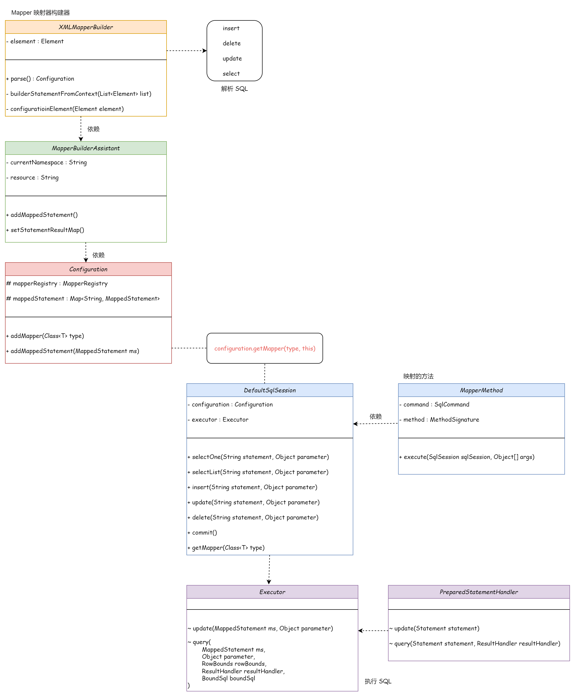

## 完善 ORM 框架





```
mybatis-q-step-11
└── src
    ├── main
    │   └── java
    │       └── cn.letout.mybatis
    │           ├── binding
    │           │   ├── MapperMethod.java
    │           │   ├── MapperProxy.java
    │           │   ├── MapperProxyFactory.java
    │           │   └── MapperRegistry.java
    │           ├── builder
    │           │   ├── xml
    │           │   │   ├── XMLConfigBuilder.java
    │           │   │   ├── XMLMapperBuilder.java
    │           │   │   └── XMLStatementBuilder.java
    │           │   ├── BaseBuilder.java
    │           │   ├── MapperBuilderAssistant.java
    │           │   ├── ParameterExpression.java
    │           │   ├── SqlSourceBuilder.java
    │           │   └── StaticSqlSource.java
    │           ├── datasource
    │           ├── executor
    │           │   ├── parameter
    │           │   │   └── ParameterHandler.java
    │           │   ├── result
    │           │   │   ├── DefaultResultContext.java
    │           │   │   └── DefaultResultHandler.java
    │           │   ├── resultset
    │           │   │   ├── DefaultResultSetHandler.java
    │           │   │   └── ResultSetHandler.java
    │           │   │   └── ResultSetWrapper.java
    │           │   ├── statement
    │           │   │   ├── BaseStatementHandler.java
    │           │   │   ├── PreparedStatementHandler.java
    │           │   │   ├── SimpleStatementHandler.java
    │           │   │   └── StatementHandler.java
    │           │   ├── BaseExecutor.java
    │           │   ├── Executor.java
    │           │   └── SimpleExecutor.java
    │           ├── io
    │           ├── mapping
    │           │   ├── BoundSql.java
    │           │   ├── Environment.java
    │           │   ├── MappedStatement.java
    │           │   ├── ParameterMapping.java
    │           │   ├── ResultMap.java
    │           │   ├── ResultMapping.java
    │           │   ├── SqlCommandType.java
    │           │   └── SqlSource.java
    │           ├── parsing
    │           ├── reflection
    │           ├── scripting
    │           │   ├── defaults
    │           │   │   ├── DefaultParameterHandler.java
    │           │   │   └── RawSqlSource.java
    │           │   ├── xmltags
    │           │   │   ├── DynamicContext.java
    │           │   │   ├── MixedSqlNode.java
    │           │   │   ├── SqlNode.java
    │           │   │   ├── StaticTextSqlNode.java
    │           │   │   ├── XMLLanguageDriver.java
    │           │   │   └── XMLScriptBuilder.java
    │           │   ├── LanguageDriver.java
    │           │   └── LanguageDriverRegistry.java
    │           ├── session
    │           │   ├── defaults
    │           │   │   ├── DefaultSqlSession.java
    │           │   │   └── DefaultSqlSessionFactory.java
    │           │   ├── Configuration.java
    │           │   ├── ResultContext.java
    │           │   ├── ResultHandler.java
    │           │   ├── RowBounds.java
    │           │   ├── SqlSession.java
    │           │   ├── SqlSessionFactory.java
    │           │   ├── SqlSessionFactoryBuilder.java
    │           │   └── TransactionIsolationLevel.java
    │           ├── transaction
    │           └── type
    └── test
```