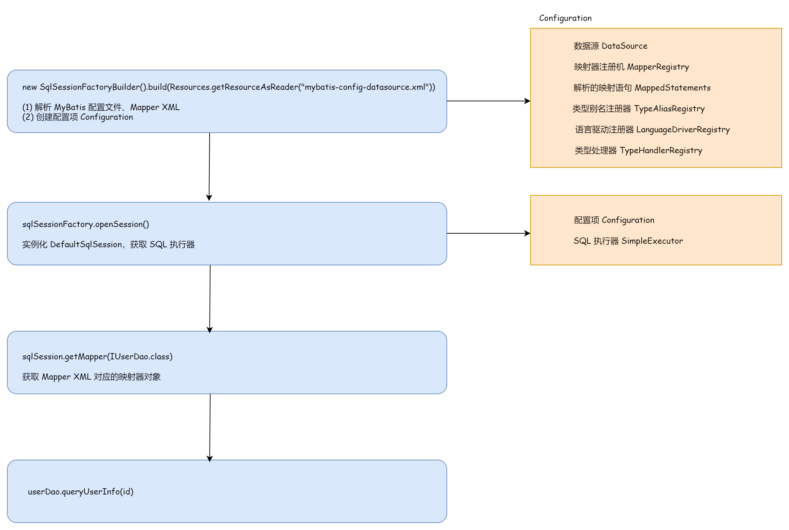

## 完善 ORM 框架流程

基于之前实现中的解析XML、处理参数、封装结果，完成所有数据库的CRUD操作。

完善SqlSession中基本操作，并在MapperMethod中调用相关的方法。

### 完善

- XMLMapperBuilder

在 `XMLMapperBuilder#configurationElement` 中对 insert/delete/update/select 节点进行解析，将解析出的对象封装成 `MappedStatement` 对象，
并保存在 `Configuration -> Map` 中，提供给 DefaultSession 获取。

- Executor

在 Mybatis 中，insert/delete/update 都基于 `update` 实现。

在 `SimpleExecutor` 中实现 update，与 query 类似 ：（1）创建语句处理器 StatementHandler （2）准备执行的 SQL （3）执行 SQL

- SqlSession

在 `DefaultSqlSession` 中调用 Executor 定义的 SQL 方法，

最后在 `MapperMethod#execute()` 中，针对每种 SQL 类型，调用 SqlSession 实现的方法。

